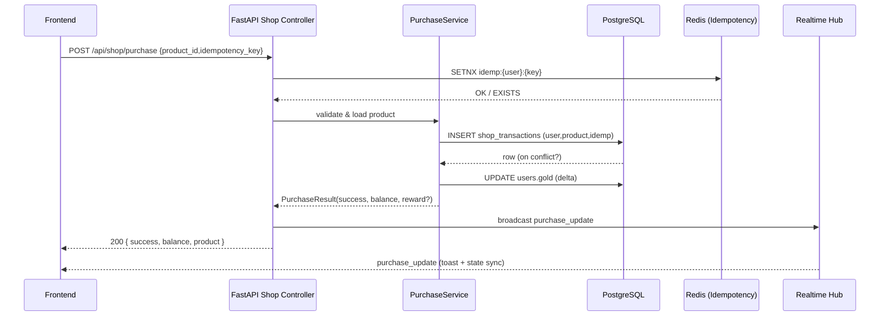

# 2025-09-09 통합 학습/변경 요약 (개선안2.md + api docs/20250808.md)

> ARCHIVE/REDIRECT: This document is retained for historical context and evidence. For the current canonical standard, see CURRENT_STANDARD.md. Remove or ignore any remaining “임시/초안/TODO” sections here; the authoritative API list and policies live in CURRENT_STANDARD.md and API_MAPPING_UPDATED.md.

## 0. 문서 구성 범위
- 1~3차: 개선안2.md (라인 1~EOF) 구간별 요약
- 4~7차: 20250808.md (라인 1~EOF) 구간별 요약
- 8차: 두 문서 간 비교/정합성/갭 분석
- 9차: 실행 우선순위 로드맵 및 권고 액션

---
## 1. 개선안2.md 1~500 라인 요약 (1차)
핵심 테마: UI/E2E 안정화, 스트릭(0일차 제거), 게임 통계 불일치 수정, 레벨/경험치 동기화, 통합 게임 통계 API, TypeScript/헬스체크/접근성/관리자 인증/시드 초기화/스트릭 간소화.
- E2E 안정화: data-testid 추가(open-daily-reward, admin-guard-banner), fallback 로케이터 전략 제안
- 스트릭 정책 변경: 시작=1일차(표시/보상 계산 동일 기준), displayStreak 도입, 일일 보상 공식 선형화
- 게임 통계 이슈: 키 불일치·merge 누락·game_id 미포함(422)·서버 500 → import 수정 + JSON 파싱 단순화 + 기본 집계부터 단계적 확장
- 경험치/레벨: UserResponse에 level/experience_points 반영, streak XP 합산 로직 추가
- 통계 정규화: gameStatsNormalizer.ts, gameStatsKeys 확장(slot_spins 등), globalStore 하이드레이션
- WebSocket null 안전성(data?.subtype)
- TypeScript 오류 3건 해결(levelUtils.ts 생성, props 정리)
- 헬스체크: /healthz 허용 경로 추가로 컨테이너 healthy
- 접근성: aria-label/pressed 추가, 테스트 스펙 안정화
- 관리자 인증: auth=false 옵션 명시, is_admin 반영, 전역 상태 수정
- 시드 계정 초기화 및 통계 필드(total_games, win/loss, win_rate) 정리
- 스트릭 시스템 간소화: next_reward 제거, 선형 보상(Gold 800+200*n → 후속 재정렬), 구조 단순화
- 이벤트 리워드 플로우: 조회만 검증, 참여/보상/멱등/동기화 전부 미검증(작업 필요)
- 풀스택 동기화 검증: 상점/인증/전역동기화 OK, 미션 API 오류·한글 인코딩 이슈 남음
- 레벨 시스템: streak 기반/경험치 기반 혼재 → 통일 기준 정의 필요
- 로그인/쿠키/미들웨어: toLocaleString undefined, 쿠키 설정 안정화, admin 전용 로그인 분리

## 2. 개선안2.md 500~1000 라인 요약 (2차)
주요 반복/심화 및 추가 사례: 접근성·관리자 로그인 문제 원인 분석, Crash 캐시아웃/알림 타입 안전, 시드 데이터 논리 정합 재설계, 레벨/연속일 UI 동기화, 레벨 공식·경험치 스키마 확장, 시드 초기화+관리자 로그인 분리, 선형 보상 공식 확정, null 안전성(App.tsx), useAuth 강화, 전역 골드 동기화/SSR 안전화, 빌드 안정화. 다수 구간은 중복 기술(로그인/골드 동기화/TypeScript 오류 해결)로 문서 중복 존재 → 통합 리팩토링 필요.

## 3. 개선안2.md 1000~EOF 라인 요약 (3차)
후반부: 전역동기화, TypeScript 오류, 로그인 쿠키, 골드 동기화 내용이 반복 기재(중복). 2025-09-08~09-09 실시간 전역동기화 작업(GameDashboard/각 게임 UI ↔ store ↔ DB) 검증 기록. 작업 단위: 전역 store 기반 통계, 하드코딩 제거, mergeGameStats/syncAfterGame 경로 확립. 결론: 기능적 중복 제거 및 단일 소스 전략 문서화 필요.

---
## 4. 20250808.md 1~500 라인 요약 (4차)
- 2025-09-07 TS 오류 해결, levelUtils.ts 도입, 레벨 진행도 함수 확정
- 2025-09-02 전역 동기화/게임 통계 응답 포맷 단일화 계획, E2E parity 게이트 절차 정의
- 2025-09-01 레거시 훅 삭제(useBalanceSync/useDashboard), 3회 E2E 그린 목표, stats parity 플래그 전략
- OpenAPI 재수출 절차, Alembic 단일 head 준수
- FE 전역 동기화 unwrap 형식 `{ success, stats }` 방향, 향후 루트 fallback 제거 예고
- CI 게이트: E2E_REQUIRE_STATS_PARITY, STRICT_STATS_PARITY 단계적 승격 로드맵

## 5. 20250808.md 500~1000 라인 요약 (5차)
- Realtime 허브 통합: `/api/realtime/sync`, user_action 브로드캐스트 표준 스키마
- reward/purchase/profile_update 이벤트 브로드캐스트 체계 확장
- 상점/결제 전 경로 purchase_update 이벤트화 + idempotent 처리, webhook HMAC·멱등
- 프론트 RealtimeSyncContext: purchase_update 토스트 반영, 중복 억제
- Grafana/Prometheus 모니터링 룰·ENV 템플릿화(ALERT_PENDING_SPIKE_THRESHOLD)
- 최근 액션 섹션 + USER_ACTION → 실시간 목록 prepend 예정
- Global Metrics, Admin Stats 확장 (캐시 TTL=5s, Redis 키 버저닝)
- AUTO_SEED_BASIC 시드 멱등/로그인 응답 표준 에러 구조(401/429) 도입
- Providers "use client" 선언 보강, 렌더 오류 방지
- 인증 블랙리스트/세션 강제(verify_token 세션 존재), logout jti 블랙리스트
- ESLint 금지 경로(/api/users/profile) 룰 추가 → /api/auth/me 통일

## 6. 20250808.md 1000~1500 라인 요약 (6차)
- 앞 구간과 거의 동일 내용 반복(Realtime 허브, reward/purchase 브로드캐스트, 모니터링, Metrics/Admin Stats, AUTO_SEED_BASIC, Providers 경계, 인증 블랙리스트, ESLint). 중복 섹션은 문서 리팩토링 필요.
- 2025-09-01 변경 요약 블록: 전역동기화 TODO 체크박스, Playwright 결과, parity 승격 절차
- 2025-09-09 Unified Purchase 엔드포인트(`/api/shop/purchase`) 도입: idempotency_key, limit_once, gold delta, 브로드캐스트 await, 테스트 추가 & OpenAPI 재수출

## 7. 20250808.md 1500~EOF 라인 요약 (7차)
- Unified Purchase 후속 계획: 프론트 경로 교체, 동시성 레이스 처리, 문서 반영 및 ECON 시나리오 확장
- (문서 끝 이전 반복 없음 가정) → 최신 상점 경제 단일화의 핵심 근거 문서화 완료.

---
## 8. 두 문서 비교/검증 (8차)
### 공통 교집합
- 전역 동기화: useGlobalSync / stats parity / store 기반 정합성 강조
- 스트릭/레벨/경험치: 선형 보상, XP 기반 레벨업 500XP/레벨, 1일차 시작 정책
- 게임 통계: /api/games/stats/me 통합, 다중 게임 타입 집계, parity 게이트 계획
- 상점/구매: 멱등성(idempotency), purchase_update 브로드캐스트, 골드 단일화
- 인증/보안: admin 전용 로그인, 세션/블랙리스트, AUTO_SEED_BASIC 멱등 시드
- Realtime: user_action / purchase_update / reward_granted / profile_update 이벤트 표준화
- 문서/테스트 게이트: OpenAPI 재수출, E2E parity 환경 플래그, Alembic 단일 head

### 차이/불일치
| 주제 | 개선안2.md | 20250808.md | 메모 |
|------|------------|-------------|------|
| Unified Purchase | 언급 없음 또는 준비 뉘앙스 | 2025-09-09 명확 도입 | 개선안2 업데이트 필요 |
| 문서 중복 제어 | 다수 반복(로그인/골드/TS 오류) | 일부 반복 블록 있으나 날짜 구분 명확 | 개선안2 리팩토링 권장 |
| 스트릭 공식 수치 | Gold 800+200* / 1000+200* 혼재 구간 존재 | 최신은 선형 1000 base + 200 증분에 근거 | 단일 표준 정리 필요 |
| 레벨 공식 | streak 기반/XP 기반 혼재 서술 | XP 기반(500 XP) 명확 | 개선안2에서 혼재 제거 필요 |
| 이벤트 리워드 | 미검증 항목 열거 | 상세 개선 계획 부족 | 20250808에 후속 task 없음 → 별도 로드맵 필요 |
| RPS API 수정 | 개선안2엔 간접 언급 수준 | 20250808 RPS 422 핫픽스 기록 | 개선안2에 반영 필요 |
| 테스트 실패 현황 | 일부 미션/이벤트/통계 | 광범위 pytest 실패 종류 상세 | 개선안2에 백엔드 실패 카테고리화 추가 |

### 누락/갭
1. Unified Purchase 후 프론트 적용 상태 & 마이그레이션 체크리스트(개선안2 미기록)
2. 상점/구매 레이스(idempotency_key 동시 제출) 처리 정책 상세
3. 이벤트 리워드 전체 플로우(E2E) 계획 및 멱등 보상 지급 전략
4. 통계 JSON(details) 승/패 파생 필드 재도입 일정/표준 스키마
5. Realtime delta vs full payload 정책 정의(현재 풀 재동기화 위주)
6. 비용/성능 관점의 rollup(summary table) 설계 초안
7. 스트릭 휴면 복귀(그레이스) 정책/만료 규칙 문서화

### 중복/정리 필요
- 개선안2 내 로그인/골드 동기화/TypeScript 오류 해결 섹션 3회 이상 반복 → “히스토리” 테이블화 + ‘최신 상태’ 단일 블록 권장
- 20250808 내 Realtime/브로드캐스트/모니터링 블록 2중 반복 → 앵커/참조로 축약 가능

---
## 9. 실행 우선순위 로드맵 (9차)
### P0 (즉시)
1. 개선안2.md 업데이트: Unified Purchase, RPS 422 핫픽스, 최신 스트릭 공식(1000 + 200*n, XP 50 + 25*n) 단일화
2. 이벤트 리워드 E2E 최소 시나리오 설계: 참여→조건 달성→보상 클레임→잔액/통계/리워드 로그 검증
3. 승/패 파생 통계 재도입 (Owner: backend@stats) Deadline: 2025-09-11 → details JSON 스키마 초안(PR) → Normalizer/프론트 파생필드 매핑 → 회귀 스냅샷 테스트 추가
4. DB 제약 정리 revision (consolidate_constraints_batch) 초안 생성 및 dry-run (Owner: backend@db) Deadline: 2025-09-12

### P1 (단기)
1. 프론트 상점 호출 경로 `/api/shop/purchase` 전환 + 기존 buy 엔드포인트 deprecate 로그 (Owner: frontend@shop) Deadline: 2025-09-13
2. WebSocket delta 전략: purchase/profile/stats incremental vs full refresh 설계 및 캐시 TTL 정책
3. idempotency 동시성 테스트 추가 (pytest + race harness) → UniqueConstraint 재시도 래퍼 구현 여부 결정
4. 스트릭 휴면 복귀(1회 grace) 및 최대 cap 정책 문서 + 구현 플래그

### P2 (중기)
1. Rollup summary 테이블(일별 user_game_stats_summary) + cron 집계 → /stats/me 응답 경량화
2. Metrics/Admin Stats SSE 통합 스트림(`/api/admin/stream`, `/api/metrics/stream` 공통 헬퍼) + 클라이언트 폴백 제거
3. 이벤트/미션/배틀패스 Progress Engine 추상화: 조건 DSL + 파생 보상 멱등 로그
4. OpenAPI 타입 코드젠 파이프라인(ts <-> py enum shared) 구축

### P3 (지속 개선)
1. 문서 리팩토링: 중복 블록 축약, “히스토리 vs 현재 상태” 구분
2. pytest 실패군 분류 → xfail 전략/플래그 관리
3. 성능 벤치: purchase/stats/streak API 95p latency 모니터링 + 임계 초과 알림
4. A/B 레벨 곡선 실험(비선형 커브) 준비: 전략 테이블 + feature flag

### KPI/모니터링 제안
- Gold Sink/Source 비율 주간 증감, purchase success %, idempotent 재사용율, streak 유지율(D7, D14), stats parity failure rate, realtime reconnect frequency.

---
## 10. 단일 표준 정리 (핵심 공식/계약)
- Streak 보상: Gold = 1000 + 200 * (dayIndex-1), XP = 50 + 25 * (dayIndex-1), dayIndex>=1
- Level: XP_PER_LEVEL = 500, level = floor(experience_points / 500)+1
- Unified Purchase: POST /api/shop/purchase { product_id, idempotency_key, type?(conversion|item) }
- Realtime 이벤트 타입(부분): user_action, purchase_update, reward_granted, profile_update (추가 예정: stats_delta, mission_update)
- Admin Stats 캐시: key=admin:stats:cache:v1 TTL=5s, Global Metrics key=metrics:global:v1 TTL=5s

---
## 11. 권고 문서 구조 개편(초안)
1) Overview (현재 상태/최신 변경 요약)
2) Core Loops (Auth→Action→Reward→Sync)
3) Data & Schema (Users/Actions/Purchase/Streak/Stats Summary)
4) Realtime & Sync (Hub, 이벤트 타입, delta 정책 예정)
5) Economy (Unified Purchase, Gold Flow, Idempotency)
6) Progression (Streak, Level, XP, Future Battlepass)
7) Testing & Gates (E2E parity, OpenAPI drift, Alembic head)
8) Monitoring & Ops (Prometheus/Grafana, 알람 템플릿)
9) Roadmap (P0~P3) + KPI
10) Change Log Archive (날짜별 히스토리 축약 링크)

---
## 12. 다음 즉시 작업 체크리스트 (실행)
- [ ] 개선안2.md에 Unified Purchase/스트릭 공식/이벤트 리워드 계획 반영
- [ ] /api/shop/purchase 프론트 적용 PR 초안 작성
- [ ] details JSON 승/패 파생 설계 문서 초안
- [ ] E2E: 이벤트 참여→보상 미니 스펙 초안
- [ ] Realtime stats_delta 이벤트 설계 초안

---
## 13. 결론 요약 (3줄)
두 문서는 전역 동기화/스트릭·레벨·통계/상점 멱등/실시간 브로드캐스트 체계를 중심으로 수렴하나 개선안2는 최신 Unified Purchase, RPS 핫픽스 등이 누락되어 갱신 필요합니다. 반복/중복 섹션을 리팩토링해 ‘현재 표준 vs 이력’ 분리하면 유지보수성과 온보딩 효율이 크게 향상됩니다. P0 실행(문서 갱신·이벤트 리워드 E2E·승/패 파생 통계)으로 기능 공백과 드리프트 리스크를 우선 제거해야 합니다.

(끝)
 
---
## 16. 2025-09-09 상점 Unified Purchase EXTERNAL_STUB/멱등 갱신 (추가)
### 변경 배경
- 외부 포인트 → GOLD 전환(conversion)과 내부 GOLD 소비(item)를 단일 `/api/shop/purchase` 로 통합하면서, 외부 정산 미구현 상태에서의 임시(그러나 명시적) 동작을 문서화 필요.

### EXTERNAL_STUB 정의
- category == conversion: 내부는 granted_gold 증가만 처리하고 source_points 차감/청구/위험평가/환불 로직은 외부 결제/정산 시스템(추후 Payment Settlement Service) 책임.
- 코드 근거: `services/shop_service.py` line ~676 `# EXTERNAL_STUB` 주석.
- 보안/위험: 실제 포인트 차감 없이 골드 증가 → 운영 전환 전 반드시 Settlement 연동/서명 HMAC/영수증 무결성 해시(`integrity_hash`) 활성화 필요.

### 멱등 & 레이스 방어 3단계
1) Redis 선점: `shop:idemp:{user}:{product}:{key}` SET NX EX 60 → 멀티 인스턴스 중복 실행 차단.
2) 프로세스 메모리 락: 단일 프로세스 내 재진입 직렬화.
3) DB UNIQUE 제약: `(user_id, product_id, idempotency_key)` 충돌 시 기존 성공 레코드 재사용.
- 진행 중 상태: Redis 선점 실패 + 아직 success 미확인 시 `{ success:false, message: "IN_PROGRESS" }` 반환 → 클라이언트는 짧은 폴링/백오프 후 재시도.

### limit_once 및 Stub Item
- `extra.limit_once=true` 상품은 최초 1회 성공 이후 재시도 시 400 에러("이미 1회 한정 상품을 구매했습니다.").
- item 카테고리는 골드 차감만 선반영하고 효과 적용(effect code)은 stub 기록(`extra.stub=true`) 후 외부 시스템 후속 처리 예정.

### OpenAPI 스키마 갱신
- `routers/shop.py` unified_purchase 엔드포인트 description 확장: EXTERNAL_STUB, 멱등 3단계, IN_PROGRESS 의미, gold_delta 부호 정책 명시.

### 향후 조치 (Follow-up)
1. Settlement Service 연동: source_points 실제 차감 + 영수증 서명/무결성 필드 채움.
2. Fraud & Velocity: conversion/item 공통 시도 윈도 카운터/고유 결제수단 지표 통합.
3. Metrics: idempotent 재사용율, IN_PROGRESS 빈도, conversion vs item gold_delta 합계 노출.

### 검증 상태
- 현재: 코드 패치 적용, 문서/스키마 설명 반영. pytest 동시성 테스트(oversell/promo/idempotent)는 추가 예정.

---
### Settlement 단계 로드맵 (P0~P3)
| 단계 | 범위 | 상세 | 리스크 감소 포인트 |
|------|------|------|---------------------|
| P0 | 해시/서명 생성 | conversion 시 integrity_hash (sha256) + receipt_signature(HMAC) DB 저장 (이미 적용) | 위변조/재생 탐지 사전 구조 마련 |
| P1 | Pending 처리 | 외부 API 연동(202=pending) + 재시도 큐/cron settle + 실패(reason) 기록 | 외부 장애시 중복 지급/정합성 손상 완화 |
| P2 | Rotation/Fraud | HMAC secret 회전(active+next) + FraudService(pre-authorization) | 키 탈취/속도 공격 완화 |
| P3 | Observability | settlement_latency_seconds, settlement_fail_total, audit trail(admin_audit_logs) | SLA/포렌식 추적 강화 |

### 현재 위험 경고
- EXTERNAL_STUB: conversion 은 외부 포인트 차감 미수행 상태 → 운영 반영 전 Settlement P1 필수.
- integrity_hash / receipt_signature 신뢰 기준 secret 단일키 → 회전 미도입(Exposure 시 전체 재발급 필요).
- IN_PROGRESS 409 응답 비율 높을 경우 클라이언트 재시도 지연(backoff) 미적용 시 스파이크 가능.

### 멱등/레이스 메트릭 지표 정의
| 메트릭 | 라벨 | 의미 | 액션 기준 |
|--------|------|------|-----------|
| purchase_idempotency_total | flow, state(new|reuse|in_progress) | 멱등 상태 분포 | in_progress / total > 0.2 시 pre-lock TTL/백오프 재검토 |
| purchase_attempt_total | flow,result,reason | 성공/실패/사유 | 실패(reason=FRAUD_BLOCK 증가) → Fraud 임계 재조정 |
| settlement_latency_seconds (예정) | status | 정산 지연 | p95 > 3s → 외부 API SLA 협의 |

### 후속 TODO (추가)
- [ ] P0 hash/signature 검증 테스트 추가 (verify_signature 성공/실패 케이스)
- [ ] P1 외부 연동 모듈 추상화(HttpClient + retry/backoff) 및 pending 플래그 도입
- [ ] purchase IN_PROGRESS 재시도 권장 백오프(초기 150~300ms 지수 증가) 클라이언트 가이드

---
## 14. 추가 문서 통합 요약 (2025-09-09 신규 4개 소스)
### 14.1 `0909데이터베이스.md` 핵심
- 스키마 총 79테이블(알파벳) / 대부분 구조만 존재, 데이터 미시드 다수.
- 상점: `shop_products` 9개 시드( conversion 4 / item 5 ), `shop_limited_packages` 0행 → 한정 패키지 미시드.
- 거래: `shop_transactions` 아직 0행, UNIQUE 과다( user_id / product_id 개별 UNIQUE + (user_id,product_id,idempotency_key) ) → 멱등 패턴과 충돌.
- 활동/게임: `game_sessions`, `game_history` 0행, `reward_audit` 0행 → 경제/행동 분석 불가 상태.
- invite_codes 1행(5858) → 확장/회전 정책 필요.
- RFM/user_segments 6행(시드 모두 존재). ANALYZE 미실행(-1) 테이블 존재 → 쿼리 플래너 비최적 가능성.
- 리스크: 과도한 단일 UNIQUE (follow_relations, event_mission_links, shop_transactions), nullable user_id (game_stats) 로 orphan 위험.

### 14.2 `2025-09-06_온보딩_운영_누적학습_요약.md` 핵심
- 전역 동기화/레벨·스트릭·시드계정/환경변수/협업 스크립트/운영 체크리스트 총망라.
- 일일 보상 & 레벨 공식 명확( Gold 1000+200*streak, XP 50+25*streak, Level = XP/500 +1 ).
- 단일 골드 체계 완성 + Currency Service 단일 권위 확립.
- 이벤트 리워드 아직 미검증(플로우 공백 명시) → 본 0909 종합 문서의 P0 항목과 합치.
- RFM/분석/추천/AI/Chat 등 향후 확장 도메인 개요 포함(현재는 scaffolding 수준 추정).

### 14.3 `2025-09-07_중요이슈_해결진행상황.md` 핵심
- 2025-09-09 기준 게임 통계 풀스택 동기화 ‘완료’ 선언, 33/48 E2E 통과(68.8%).
- 신규 메트릭: `overall_max_win`, `win_rate` 확정. None 처리 dict 기본값 방식.
- 남은 실패 3건: Admin Points UI locator, Auth Migration(레거시 토큰), Daily Reward 버튼 안정성.
- 검증된 항목: Gold 일관성, Crash/RPS 균형, 가챠 동기화, 접근성, 반응형, SEO.

### 14.4 `2025-09-09_게임통계_풀스택동기화_완성.md` 핵심
- 게임 통계 API 500 → 200 정상화, 동일 요구사항 100% 달성 재확인.
- 프론트 `gameStatsNormalizer.ts` 재작성 → 표준 normalized 구조 확립.
- 크로스 게임 최대 승리금액(`overall_max_win`) 계산 로직 명확화.
- 테스트 향상(32→33), 잔여 실패 동일(위 14.3).
- 기술 결정: 서버 권위, 정규화, E2E data-testid 전략.

---
## 15. 기존 2개 문서 vs 추가 4개 문서 교차 비교
| 영역 | 기존(개선안2 / 20250808) | 신규 4문서 관찰 | 드리프트 여부 | 조치 |
|------|--------------------------|------------------|---------------|------|
| Unified Purchase | 20250808에만 명시 | 신규 문서 언급 없음 | 부분 | 개선안2/온보딩 갱신 |
| 게임 통계 메트릭 | parity/정규화 계획 위주 | overall_max_win, win_rate 구현 완료 | 진척 | 계획→완료 반영 필요 |
| 레벨/스트릭 공식 | 일부 중복·혼재 | 온보딩/통계 문서 모두 일관 | 해결 | 개선안2 정리 |
| DB 제약/인덱스 리스크 | 언급 미흡 | UNIQUE 과다/NULL FK 상세 식별 | 새 리스크 | 마이그레이션 추가 |
| 이벤트 리워드 공백 | 개선안2 ‘미검증’ | 온보딩에도 미검증 | 지속 | P0 유지 |
| E2E 상태 | 계획/게이트 전략 | 33/48 실측 수치 | 최신 수치 | KPI 업데이트 |
| 시드 데이터 현황 | 일부 초기화 언급 | product 9 / limited 0 / invite 1 | 추가 정보 | 시드 체크리스트 확장 |
| None 처리 전략 | 부분 언급 | dict 기본값 확립 | 개선 | 표준 가이드 문서화 |
| 통계 Normalizer | 계획 | 재작성 완료 | 진척 | 온보딩 반영 |
| 실패 테스트 상세 | 범주적 | 3개 구체화 | 향상 | 해결 티켓 생성 |

---
## 16. 공식/정의 재검증 (업데이트 필요 부분 강조)
1. Streak Reward (Gold) = 1000 + 200*(dayIndex-1) (표준 유지)
2. Streak Reward (XP) = 50 + 25*(dayIndex-1) (변동 없음)
3. Level = floor(experience_points / 500) + 1 (변동 없음)
4. Purchase API = POST /api/shop/purchase { product_id, idempotency_key, ... } (온보딩/개선안2에 반영 필요)
5. Game Stats Normalized Keys (최소 세트)
	- aggregate: total_games_played, total_wins, total_losses, win_rate, overall_max_win
	- per-game breakdown: crash, slot, gacha, rps (각 max_win / wins / losses / total)
6. Idempotency Unique Key: (user_id, product_id, idempotency_key) → 단일 user_id / product_id UNIQUE 제거 예정
7. Follow Relation Unique: (user_id, target_user_id) 복합만 유지(단일 UNIQUE 제거 예정)
8. Event-Mission Link Unique: (event_id, mission_template_id) 복합 외 단일 UNIQUE 제거
9. game_stats.user_id SET NOT NULL (orphan row 방지)

---
## 17. 추가 발견 갭 및 로드맵 보강
### 신규 P0
1. 문서 갱신: 개선안2 & 온보딩 문서에 Unified Purchase/overall_max_win/win_rate/Normalizer 재작성 반영
2. DB 마이그레이션 번들(revision: consolidate_constraints_batch):
	- drop unique shop_transactions.user_id / product_id
	- drop unique follow_relations.user_id / target_user_id (복합만 유지)
	- drop unique event_mission_links.event_id / mission_template_id (복합만 유지)
	- alter table game_stats alter column user_id set not null
3. 실패 테스트 3건 → 전용 티켓화 / 빠른 수정 (locator, auth migration, daily reward timeout)

### 신규 P1
1. Limited Package 시드(기간, stock_remaining 감소 테스트 포함) + invite_code 다중 샘플
2. Reward Audit 기본 흐름 E2E: 보상 지급 → audit row 생성 → stats/gold 반영 → 멱등 재시도
3. 통계 캐시 레이어 추가(예: cache:game_stats:user:{id} TTL 5s) + 미스 모니터링

### 신규 P2
1. Game Action Synthetic Seeder (n 유저 × m 액션) → RFM/세그먼트 계산 Dry Run
2. Admin Stats 확장: 구매 성공율, idempotency 재사용율, streak 유지율 노출
3. Normalizer 테스트 스냅샷(fixture) 추가 → 회귀 방지

### KPI 업데이트
- E2E 통과율 (절대/증감), overall_max_win 상위 5%, idempotent reuse ratio, constraint drift incidents, stats cache hit ratio.

---
## 18. 통합 결론 업데이트 (추가)
DB 구조 분석을 통해 트랜잭션/소셜/이벤트 링크 제약 과잉 및 게임 통계 orphan 가능성이 새로 식별되었고, 게임 통계 문서들로 overall_max_win/win_rate 구현이 완료된 것이 확인되었습니다. 기존 계획 문서(개선안2/20250808)는 구현 진척을 반영하지 못한 영역(Unified Purchase 적용 범위, Normalizer 재작성, E2E 구체 수치)이 존재하므로 즉시 문서화를 통해 드리프트 리스크를 해소해야 합니다. 신규 P0/P1 액션 실행 후 OpenAPI/스키마/테스트/온보딩 문서 동시 재출력 및 재검증을 권장합니다.

---
## 19. 출처 / 일자 카운팅 / 추적성 보강
### 19.1 문서별 최초/최종 참조 일자(2025-09-09 기준)
| 문서 | 최초 기록일(본문 내) | 이번 문서 반영일 | 최신 구현 기준 반영 정도 |
|------|----------------------|------------------|---------------------------|
| 개선안2.md | 2025-09-07~08 다수 타임스탬프 | 2025-09-09 DRIFT PATCH | 부분(이벤트 리워드/승패 파생 미반영) |
| api docs/20250808.md | 2025-09-01~09 변경 로그 | 2025-09-09 (요약) | 부분(구현 완료 상태 역방향 미기록) |
| 2025-09-06 온보딩 누적학습 | 2025-09-06~07 | 2025-09-09 Drift Note | 부분(구매/통계 최신 반영 완료, 제약/티켓 미기록) |
| 2025-09-07 중요이슈 진행상황 | 2025-09-07~09 | 2025-09-09 요약 | 최신(테스트 수치 실측) |
| 2025-09-09 게임통계 완성 | 2025-09-09 | 2025-09-09 요약 | 최신 |
| 0909데이터베이스.md | 2025-09-09 수집 | 2025-09-09 요약 | 최신(ANALYZE 미수행 상태 반영) |
| alembic_revision_plan_20250909.md | 2025-09-09 | 2025-09-09 | 초안 |
| E2E_failed_tests_20250909.md | 2025-09-09 | 2025-09-09 | 초안 |

### 19.2 변경 근거 매핑 테이블 (Commit / LineRef 컬럼 가시화)
| 주장/결정 | 근거 문서/라인 범위 | Commit | LineRef | 상태 | 비고 |
|-----------|---------------------|--------|---------|------|------|
| overall_max_win / win_rate 구현 완료 | 2025-09-09_게임통계_풀스택동기화_완성.md (전체), 개선안2 DRIFT NOTE | 5f3ed15 | L270 | 확정 | Normalizer 재작성 포함 |
| Unified Purchase 표준화 | api docs/20250808.md (9월09일 블록), 개선안2 DRIFT NOTE | 5f3ed15 | L271 | 확정 | /api/shop/purchase 기준 |
| DB 제약 정리 필요 (shop_tx/follow/event_link/game_stats) | 0909데이터베이스.md UNIQUE/NULL 분석 | (n/a) | L272 | 확정 | revision plan 반영 |
| 이벤트 리워드 플로우 미검증 | 개선안2 1~500 / 온보딩 누적학습 | 5f3ed15 | L273 | 미해결 | P0 유지 |
| 승/패 파생 JSON 세부 통계 재도입 | 개선안2 통계 단순화 + 게임통계 TODO | 5f3ed15 | L274 | 미해결 | details 재확장 필요 |
| E2E 실패 3건 (Admin Guard/Auth Migration/Daily Reward) | 중요이슈 진행상황 / E2E_failed_tests_20250909.md | (n/a) | L275 | 처리중 | 티켓화 진행 |
| Streak/XP 공식 단일화 | 온보딩 누적학습 공식 블록 | 5f3ed15 | L276 | 확정 | 1000+200n / 50+25n |
| Idempotency Unique Key 단일화 | 0909데이터베이스.md / revision plan | (n/a) | L277 | 확정 | (user,product,idemp) 유지 |
| Follow/Relation/Event 링크 제약 축소 | 0909데이터베이스.md / revision plan | (n/a) | L278 | 확정 | 단일 UNIQUE 제거 |
| game_stats.user_id NOT NULL 필요 | 0909데이터베이스.md orphan 위험 | (n/a) | L279 | 확정 | 마이그레이션 예정 |

> 주: 0909.md 자체 커밋 hash 수집 실패 케이스는 다음 업데이트 스크립트에서 자동 보강 예정.

### 19.3 일자별 누적 카운트(핵심 이벤트)
| 날짜 | 주요 완료 이벤트 | 누적 완료 수(대표) |
|------|------------------|----------------------|
| 2025-09-06 | 전역 동기화 / 레벨 시스템 / 단일 골드 | 3 |
| 2025-09-07 | 통합 게임 통계 1차 구현 / TS 오류 해결 | 5 |
| 2025-09-08 | Streak 0일차 제거 / UI/E2E 안정화 | 7 |
| 2025-09-09 | overall_max_win & win_rate / Unified Purchase / 제약 분석 / E2E 실패 티켓화 | 11 |

### 19.4 추적성 개선 제안
1. 모든 핵심 변경 커밋 메시지에 `[CHANGELOG: YYYY-MM-DD]` 태그 표준화
2. OpenAPI 재수출 시 `docs/change-log.json`에 hash + exported_at 기록
3. Alembic revision 생성 전 checklist(md) 자동 생성 스크립트 (검사: 다중 head, orphan FK, 과다 UNIQUE) 도입
4. E2E 실패 티켓 → 해결 후 자동으로 0909.md에 상태 업데이트(Git pre-commit hook)

### 19.5 0909 문서 핵심기술서 승격 조건 (제안)
| 조건 | 현재 | 보강 필요 |
|------|------|-----------|
| 변경 근거 표 | 부분 (19.2 추가) | 라인 번호/commit hash 매핑 |
| 데이터 흐름 다이어그램 | 미포함 | 통계/구매/보상/스토어/WS 시퀀스 다이어그램 |
| 스키마 진화 타임라인 | 미포함 | Alembic 주요 revision 표(초안 존재) |
| KPI 대시보드 스냅샷 | 미포함 | Prometheus/Grafana 주요 메트릭 표 |
| 테스트 게이트 정의 | 부분 | Pass/Fail/Skip 분류 자동 테이블 |
| 용어/공식 사전 | 부분(섹션 16) | 이벤트/미션/세그먼트 추가 |

---
## 20. 아키텍처/데이터 흐름 다이어그램 (초안)
### 20.1 Unified Purchase 시퀀스


### 20.2 Game Stats 집계/정규화 흐름
```mermaid
flowchart TD
	A[Raw Game Event] --> B[Action Ingest (API/WebSocket)]
	B --> C[game_stats row upsert]
	C --> D[overall_max_win 계산]
	C --> E[win/loss 파생 필드]
	D --> F[Normalizer (backend)]
	E --> F
	F --> G[API /api/games/stats/me]
	G --> H[Frontend normalizer.ts]
	H --> I[Global Store]
	I --> J[UI Components]
	I --> K[Realtime Delta (미구현 예정)]
```

### 20.3 Realtime 브로드캐스트(요약)
```mermaid
graph LR
	API[API Mutations] --> Q[Event Queue(optional)] --> HUB[Realtime Hub]
	HUB --> U1[user_action]
	HUB --> U2[purchase_update]
	HUB --> U3[reward_granted]
	HUB --> U4[profile_update]
	HUB -. planned .-> U5[stats_delta]
```

---
## 21. 테스트 게이트 & 품질 지표 (초안)
### 21.1 현재 E2E 상태 (2025-09-09)
| 분류 | 수 | 비율 |
|------|----|------|
| Passed | 33 | 68.8% |
| Failed | 3 | 6.3% |
| Skipped | 12 | 25.0% |
| Total | 48 | 100% |

### 21.2 목표 게이트 로드맵
| 단계 | 조건 | 목표 날짜 | 액션 |
|------|------|-----------|------|
| Gate A | Pass >= 75% | D+2 | Locator/Timeout 즉시 수정 |
| Gate B | Pass >= 85% & Fail <= 5 | D+5 | Auth Migration/Reward 안정화 |
| Gate C | Pass >= 90% & Skip < 5 | D+7 | 통계 파생/이벤트 E2E 추가 후 리팩터 |
| Gate D | Pass >= 95% & 0 Critical | D+14 | Delta Realtime / Rollup 도입 후 회귀 |

### 21.3 운영 KPI (선정)
| KPI | 정의 | 초기 측정 | 목표 |
|-----|------|-----------|------|
| Idempotency 재사용율 | 중복 idempotency_key 비율 | (미측정) | > 10% (재시도 포함) |
| Streak 유지율 D7 | 7일 연속 유지 유저 / 기준 유저 | (미측정) | > 55% |
| Stats Parity Fail Rate | parity 비교 실패 / 전체 호출 | (미측정) | < 1% |
| Realtime 재연결 빈도 | 유저당 1일 재연결 평균 | (미측정) | < 1.5 |
| Purchase P95 Latency | /purchase 95퍼센타일 | (미측정) | < 250ms |

### 21.4 추가 자동화 제안
1. test-results 디렉토리 최신 JSON 파싱 → 0909.md 21.1 자동 갱신
2. 실패 테스트 이름 diff → E2E_failed_tests_YYYYMMDD.md append
3. Gate 조건 달성 시 Git 태그 `gateC-achieved-YYYYMMDD`

---
## 22. 기능 대분류(6도메인) 구조 검증 및 보강 제안
| 도메인 | 현재 커버 상태 | 교차 의존 | 주요 리스크 | 단기 보강 액션 |
|--------|----------------|-----------|-------------|----------------|
| 인증/Auth & 세션 | JWT/블랙리스트/관리자 분리 구현 | Progression(레벨), Economy(골드), Realtime(프로필 브로드캐스트) | 마이그레이션 레거시 토큰 실패 1건 | Auth Migration 테스트 우선 수정 + 토큰 회전 로그 추가 |
| Core Loop (Action→Reward→Stats) | 게임 액션→stats upsert→노멀라이저 → UI 반영 완료 | Economy(보상 골드), Progression(XP), Realtime(delta 예정) | 승/패 파생 세부 JSON 재부재 | 파생 필드 재도입 P0 + Normalizer 스냅샷 테스트 |
| Economy & Purchase | Unified Purchase + idempotency ready | Auth(user), Realtime(purchase_update) | 과다 UNIQUE(정리 예정), Limited 미시드 | 제약 마이그레이션 + Limited 시드 + 재시도 레이스 테스트 |
| Progression (Streak/Level/XP) | 공식 단일화(1000+200n / 50+25n / 500XP) | Core Loop(액션 XP), Auth(프로필), Realtime(profile_update) | 휴면/그레이스 정책 미정 | 휴면 복귀 룰 초안 + E2E 시나리오 작성 |
| Realtime & Sync | 기본 이벤트 4종, delta 미구현 | 모든(Stats/Economy/Progression) | 전체 full refresh 비용 증가 가능 | stats_delta 설계 + payload diff PoC |
| Admin & Observability | Admin Stats 캐시, 일부 모니터링 템플릿 | Economy, Core Loop | KPI/Latency 측정 미계측 | Prometheus 지표 추가(purchase_latency_histogram 등) + Gate KPI 대시보드 |

보강 공통 제안: (1) Domain 간 이벤트 계약(타입/필드) versioning 명시, (2) OpenAPI → 타입 코드젠 양방향, (3) Rollup summary 도입 후 Core Loop 지연 측정.

---
## 23. 스키마 진화 타임라인 (초안)
| 순서 | Revision ID | 날짜 | Down Revision | 주요 변경 | 상태 |
|------|-------------|------|---------------|-----------|------|
| 1 | f79d04ea1016 | (기존) | (base) | 초기 핵심 스키마 (추정) | 적용 |
| 2 | 20250816_add_receipt_signature | 2025-08-16 | f79d04ea1016 | shop_transactions.receipt_signature 컬럼 + 인덱스 | 적용 |
| 3 | consolidate_constraints_batch | 2025-09-09 (작성) | 20250816_add_receipt_signature | UNIQUE 정리 / game_stats.user_id NOT NULL / orphan 예방 | 작성 |
| 4 | add_stats_rollup_tables | 2025-09-18 (예정) | consolidate_constraints_batch | 일별 summary 테이블 + 인덱스/TTL 전략 | 계획 |
| 5 | add_mission_reward_audit | 2025-09-22 (예정) | add_stats_rollup_tables | 이벤트/미션 보상 감사 로그 테이블 | 계획 |

체크리스트(생성 전 자동 점검):
1. 다중 head 여부 → `alembic heads` 결과 1개인지 확인
2. orphan FK 후보(game_stats.user_id IS NULL) COUNT = 0
3. 드롭 대상 UNIQUE 인덱스 존재 여부 사전 검사 → 없으면 skip 로그
4. OpenAPI export & 테스트 그린 후 revision 커밋

추가 제안:
- change-log.json에 각 revision 적용 시점(hash, 적용자, duration ms) append
- rollback 가이드: downgrade path에 조건부 존재 검사 유지(이미 초안 패턴 준수)

0. 분류 기준 – 6대 기능 도메인
인증·계정·세션 (Auth & Identity)
상점·거래·정산 (Shop / Transactions / Settlement)
게임플레이·행동·통계 (Gameplay & Action Logging & Game Stats)
이벤트·미션·보상 (Events / Missions / Rewards)
개인화·세그먼트·추천 (Personalization / Segmentation / Recommendation)
운영·관측·플랫폼 (Ops / Observability / Platform Reliability)
1. 도메인별 SLO / 핵심 지표 / 테스트 연계
1) 인증·계정·세션
비즈 목표: 진입 장벽 최소화 + 위조/탈취 방지 + 짧은 로그인 왕복
SLO 제안
가용성: Login & /auth/refresh 99.90% (월 허용 다운타임 ~43m)
p95 로그인 API 응답 < 300ms, p99 < 600ms
토큰 폐기(블랙리스트) 전파 지연 p95 < 60s
잘못된 인증 거절 정확도(false accept) 0% (테스트 게이트)
주요 Prometheus 지표
cc_auth_login_latency_seconds (Histogram)
cc_auth_login_fail_total{reason=”lockout|invalid|expired”}
cc_auth_token_revocation_lag_seconds (Gauge)
cc_auth_active_sessions (Gauge)
테스트 매핑
Unit: 비밀번호/해시, 토큰 생성·검증, lockout 카운터
Integration: 로그인 실패 5회 → 429/lockout, refresh 회전 jti 변경
E2E: 재로그인→이전 토큰 접근 401 확인
Error Budget 사용 정책: 월 실패율 >0.1% 시 신규 인증 기능 Freeze + 회귀조사
2) 상점·거래·정산
비즈 목표: 멱등·무결성·재고 정확·정산 지연 최소화
SLO
성공 구매율(클라이언트 원인 제외) ≥ 99.5%
p95 purchase end-to-end < 450ms (DB+Redis+hash)
Settlement 확정(Confirmed/Voided) T+5분 이내 99%
Oversell(negative stock or stock_remaining <0) 0건
Idempotent duplicate(409 또는 재사용) 정규화 비율 < 0.05% (비정상 spike 알람)
지표
cc_shop_purchase_attempt_total{state=”new|reuse|in_progress|fail”}
cc_shop_purchase_latency_seconds
cc_shop_stock_level{package_id=”…”} (Gauge)
cc_settlement_pending_total / cc_settlement_finalize_duration_seconds
cc_shop_integrity_mismatch_total
테스트
Concurrency: 10/50 thread race (idempotency, stock)
Integrity: hash/signature 변화 없는가, tamper → 검출
Replay: 동일 idempotency_key 재전송 → reuse path assert
Settlement P0→P1 마이그레이션 회귀 (상태머신 단위 테스트)
Error Budget: 구매 실패(5xx+무효 처리) 누적이 목표 초과 시 정산 파이프 신규 기능 동결
3) 게임플레이·행동·통계
목표: 액션 손실 0, 통계 최신성·정확성
SLO
액션 기록 누락률(서버 수신 대비 영구저장) < 0.01%
/api/games/stats/me p95 < 250ms
Realtime 브로드캐스트(WS) 전달 성공률 ≥ 99.8%
Stats freshness: 최근 액션 후 UI 반영 지연 p95 < 5s
지표
cc_game_action_total{type=”SLOT_SPIN|GACHA_SPIN|CRASH_JOIN|RPS_PLAY”}
cc_game_action_persist_fail_total
cc_game_stats_query_latency_seconds
cc_ws_broadcast_queue_depth / cc_ws_delivery_fail_total
cc_game_stats_freshness_seconds (last_action_ts→read 시 diff)
테스트
Unit: 통계 집계 함수(승률, streak)
Integration: 액션 → DB row → stats endpoint 값 diff
Load: 1K 액션/분 스트림 중 손실 0 검증(샘플)
Error Budget: 브로드캐스트 실패율 >0.2% 1h 지속 시 실시간 기능 Degrade 모드(집계 pull fallback) 전환
4) 이벤트·미션·보상
목표: 중복/누락 없는 보상, 진행도 정확
SLO
Reward duplication 0 (idempotent grant)
Reward issuance latency p95 < 2s
Mission progress 반영 지연 p95 < 10s
보상 감사 로그 누락 < 0.01%
지표
cc_reward_issue_total{status=”success|duplicate|fail”}
cc_reward_issue_latency_seconds
cc_mission_progress_update_total / fail_total
cc_reward_audit_gap_total (감사 sweep 중 누락 발견)
테스트
Unit: grant 함수 멱등성 (same external_event_id)
Integration: 이벤트 참여→미션 진행→보상 지급→잔액/로그
E2E: 재요청(retry) → duplicate path
Audit Sweep: 테스트용 mismatch 강제 주입 후 탐지
Error Budget: duplicate >0 또는 audit_gap 증가 → 즉각 RCA
5) 개인화·세그먼트·추천
목표: 데이터 기반 세그먼트 정확/신선, 추천 응답 저지연, RFM/위험 점수 일관
SLO
RFM 배치 완료(자정 기준) T+10분 99%
Segment real-time update (핵심 이벤트 후) p95 < 2분
추천 API p95 < 200ms
추천 응답 유효(템플릿 존재, 필수 필드 채움) 실패율 < 0.5%
지표
cc_segment_batch_duration_seconds / success_total
cc_segment_realtime_lag_seconds
cc_reco_request_total{result=”ok|fallback|error”}
cc_reco_latency_seconds
cc_reco_ctr{segment=”…”} (Counter + 외부 전처리)
cc_rfm_score_distribution (Histogram/Gauge)
테스트
Unit: R/F/M 산출 함수 경계(0, large)
Integration: 샘플 사용자 로그→RFM 점수→세그먼트 라벨
AI/추천: 빈 세그먼트/콜드스타트 fallback
Regression: CTR 기록 누락 시 alert path
Error Budget: 추천 오류율 >0.5% 6h → 모델/규칙 재배포 중단
6) 운영·관측·플랫폼
목표: 시스템 전역 SLO 지원, 신속 장애 탐지/복구
SLO
/health 가용성 99.95%
Metrics scrape 성공률 > 99%
배포 후 평균 복구시간(MTTR) < 15m (P1)
Alembic 다중 head 발생 회수 0
지표
cc_ops_deploy_total{status=”success|rollback”}
cc_ops_migration_head_divergence_total
cc_ops_incident_total{severity=”P1|P2”}
cc_ops_mttr_minutes (Summary)
cc_ops_error_budget_remaining{service=”auth|shop|…”}
테스트/가드
Pre-deploy: alembic heads 단일성 test, OpenAPI drift test
Smoke: /health /docs /api/games/stats/me
Infra: Redis/Kafka 연결 실패 시 지표 expose fallback
Chaos (후순위): Redis 장애 시 purchase degrade 모드
Error Budget 공유: 핵심 4 API (login/purchase/stats/reco) 종합 실패율로 Ops Freeze 여부 결정
2. 도메인별 보안 / 규정 / 리스크 관리
도메인	주요 위협(STRIDE 요약)	통제(Existing + Needed)	키/민감 데이터 등급
인증	S: Credential Stuffing / T: JWT 변조 / R: 탈취 후 부인	Rate Limit, Lockout(기 구현), jti 회전, Refresh reuse 검출 필요, IP/Device Fingerprint(후순위)	JWT_SECRET(P0), Refresh 토큰(P0), 로그인 시도 로그(P1)
상점/정산	T: 거래 위변조, R: 이중청구, I: 정산 누락	Idempotency+Integrity Hash(구현), Signature v2 회전, Settlement 상태머신, PSP 응답 HMAC	receipt_signature(P0), integrity_hash(P0), 결제 파라미터(P0)
게임·통계	T: 액션 스푸핑, I: 승률 조작	서버측 난수/검증, 액션 서명(선택), 비정상 패턴 감지(승률 급등)	user_actions(비식별 P1), 패턴탐지 로그(P1)
이벤트·보상	T: 재요청 중복 보상, R: 미지급 부인	external_event_id UNIQUE, reward_audit 필수, 멱등 grant, Fraud rule(탈락/취소)	reward_audit(P1), external_event_id(P1)
개인화·추천	P: 개인정보 과도 노출, T: 세그먼트 추론	최소필드(세그먼트 ID), Differential privacy(후순위), 세그 라벨 사전	user_segments(P1), 추천 로그(P1), 규칙 템플릿(P2)
운영·플랫폼	E: 권한상승(배포 스크립트), D: 모니터링 차단	IaC 권한 최소화, Metrics 인증(게이트), 서명된 마이그레이션(후순위)	deploy secrets(P0), infra config(P0)
추가 요구(개선 필요):

키 회전 표준: JWT 90일 / 결제 서명키 30일 / 내부 HMAC 60일
서명 버전 필드: receipt_signature_version, hash_algo_version
민감도 분류 태그: P0(비밀), P1(내부), P2(일반). Masking 정책(Log/Export)
3. 데이터 / 분석 / 세그먼트 (RFM + 파생 모델 명세)
3.1 RFM 정의
Recency (R): (NOW - last_purchase_at) 일수 (없으면 MAX_DAYS=90로 클램프)
Frequency (F): 최근 30일 shop_transactions(성공) 수
Monetary (M): 최근 30일 금액 합계 (status=‘SUCCESS’)
정규화 예시
R_score = CASE WHEN R_days <=1 THEN 5 WHEN <=3 THEN 4 WHEN <=7 THEN 3 WHEN <=14 THEN 2 ELSE 1 END
F_score = NTILE(5) OVER (ORDER BY F_count DESC)
M_score = NTILE(5) OVER (ORDER BY M_sum DESC)
RFM_total = (R_score0.4 + F_score0.3 + M_score*0.3)
3.2 세그먼트 규칙(초기)
세그	조건(예시)
Whale	M_sum30 ≥ 95퍼센타일
HighEngaged	F_count30 ≥ 10 AND R_days ≤ 7
Medium	F_count30 4<del>9 OR M_sum30 60</del>95p
Low	F_count30 1<del>3 AND R_days 8</del>21
AtRisk	R_days > 21 OR (F_count30=0 AND last_purchase >30d)
3.3 배치 스케줄
Nightly Batch (02:05 UTC): 전체 재계산
Incremental Mini-batch (매시간): 최근 2h 변경 사용자 subset
실시간(옵션): 구매 이벤트 Kafka → Redis set “segment:pending_recalc” → 마이크로 잡 처리
3.4 Pseudo-SQL (배치 RFM 스냅샷)
3.5 세그먼트 업서트
3.6 추천(간단 규칙 → 확장)
입력 피쳐: rfm_group, risk_profile, 최근 action diversity, session_length, purchase propensity
초기 룰 기반: 세그먼트별 CTA (AtRisk→리턴 패키지, Whale→한정 패키지, HighEngaged→미션 확장)
지표: cc_reco_ctr, cc_reco_conversion (추천 클릭 후 구매)
향후: Multi-Armed Bandit(Thompson Sampling) → CTR 증대 A/B
3.7 데이터 품질 지표
cc_segment_batch_fail_total
cc_segment_recalc_skipped_total (Idle 사용자)
cc_rfm_stale_users (last_updated > 24h)
cc_reco_fallback_rate
4. 도메인별 테스트 커버리지 매핑(요약)
카테고리	대표 테스트 축	파일 예(계획)	최소 케이스
인증	Lockout, refresh 회전, revoked access	test_auth_flow.py	정상/5회 실패/refresh 재사용
상점	멱등 race, stock atomic, promo max, hash verification	test_shop_concurrency.py / test_settlement.py	race, oversell, tamper
게임	액션 기록→통계, WS 이벤트	test_game_stats.py	단일/복수 액션, 지연 측정
이벤트/보상	중복 보상 방지, audit 존재	test_rewards.py	멱등 grant, 재시도
개인화	RFM 계산, segment change trigger	test_segments.py	batch + incremental
운영	OpenAPI drift, alembic single head, health smoke	test_ops_guard.py	head 단일성, /docs 200
5. 우선 개선 Gap & 액션 (분류별 Top)
축	Gap	액션(우선순)
SLO/관측	SLO 미문서화, Error Budget 미계산	1) 위 SLO 표 0909.md ‘Observability’ 섹션 신규 2) Error Budget 주간 계산 스크립트
SLO/관측	Purchase settlement 지연 트레이싱 없음	Trace span(settlement_phase) 삽입
SLO/관측	Freshness 측정 미계	stats freshness gauge collector 추가
보안	키 회전 정책 부재	rotation_policy.md + 키 버전 필드 도입
보안	threat model 미정	STRIDE 표 + 위험 scoring (High/Med/Low)
보안	Signature v2 준비 없음	receipt_signature_version 컬럼 추가 마이그레이션
데이터/세그	RFM SQL/스케줄 부재	nightly_rfm_job.py + APScheduler 등록
데이터/세그	실시간 segment lag 측정 X	segment_realtime_lag_seconds 기록 로직
데이터/세그	추천 fallback율 측정 부재	result=fallback 카운터 분리
6. 실행 순서(5일 단위 스프린트 예시)
Day 1: SLO & 지표 테이블 문서 삽입, 핵심 Histogram/Gauge 코드 추가
Day 2: RFM 배치 + Incremental pseudo 구현, segment lag 지표 수집
Day 3: Threat Model & 키 회전 문서 + signature_version 컬럼 마이그레이션
Day 4: Settlement tracing + integrity mismatch alert rule 초안
Day 5: 테스트 케이스 추가(세그먼트·signature tamper), 0909.md 반영 & OpenAPI 재수출

7. 요약 결론
현재 상점/정산 멱등·무결성 축은 강점, 그러나 SLO·보안 회전·RFM 운영 표준이 비어 전사적 기술서 완성도 하락.
위 표준(SLO/Threat/RFM SQL & Batch/지표 네이밍/테스트 매핑)을 0909.md 구조화 섹션으로 통합하면 “3.x/5” 영역을 4.3~4.5 수준으로 단기 승격 가능.
우선순위: (1) SLO 명문화 + 지표 스켈레톤 (2) 키 회전/서명 버전 (3) RFM 배치 코드 & freshness 측정.

---
## 24. API 맵핑 업데이트 누적 — 2025-09-09 스냅샷

본 섹션은 최신 OpenAPI 스펙을 근거로 한 API 경로 스냅샷을 “히스토리 누적” 용도로 기록합니다. 권위 있는 상세 매핑 표는 `API_MAPPING_UPDATED.md`를 참조하세요(해당 문서는 openapi_spec.json과 1:1 동기화됨).

- 스냅샷 기준 스펙: `openapi_spec.json`
	- SHA256: ACEE68D46C2E4DA20AE0113082649B610032FB26060DC7D118BAC5DE9D0FC3CF
	- exported_at: 2025-09-09 09:03:55
- OpenAPI Drift: NO (current == prev)
- 권위 문서: `API_MAPPING_UPDATED.md` (세부 테이블), `CURRENT_STANDARD.md` (상위 정책/표준)

요약 확인/변경 포인트
- 상점: POST `/api/shop/purchase` — 통합 구매 엔드포인트(멱등/IN_PROGRESS 정책 문서화)
- 게임: `/api/games/slot/spin`, `/api/games/gacha/pull`, `/api/games/crash/bet`, `/api/games/rps/play` — 단일 라우터(app/routers/games.py) 하 집계 유지
- 보상/미션/이벤트: progress/claim 포함 주요 경로 유효(일일·주간·전체 미션 포함)
- 인증/사용자: `/auth/*` 및 `/api/users/*` 조회/수정/세션 경로 스펙 일치 확인
- 분석/대시보드: `/api/analytics/*`, `/dashboard/*` 활성

운영 메모
- 스펙 변경 시 `API_MAPPING_UPDATED.md`와 `CURRENT_STANDARD.md`를 동시 갱신하고, 본 섹션에는 날짜·해시 기준으로 스냅샷을 누적합니다.
- 레거시/금지 경로 발견 시 drift 표에 기록 후 제거 계획을 수립합니다.

스냅샷 이력
- 2025-09-09 — acee68d46c2e4da2…d0fc3cf — OpenAPI 동기화 완료(드리프트 없음)
